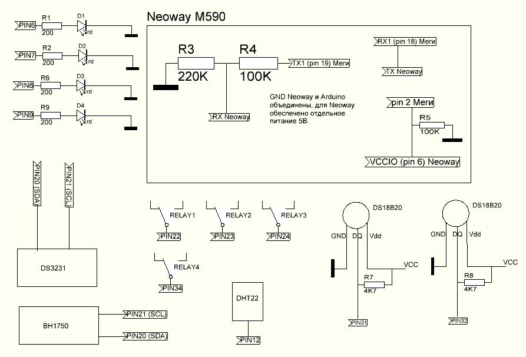

# Контроллер теплицы на Arduino Mega

В папке SOFT - текущая версия конфигуратора, коннектится к Меге по COM-порту.
 В папке Mega - прошивка для Меги.
 

# Как использовать

Сначала надо установить в Arduino IDE необходимые библиотеки (они в папке LibrariesUsed), затем переходить к следующему шагу. Как устанавливать библиотеки в Arduino IDE - гугль знает.

Открыть в Arduino IDE файл Main.ino, настроить директивы условной компиляции (файл Globals.h), скомпилировать его и закачать в Мегу. Подсоединить зелёный светодиод к пину 6, красный - к пину 7. При необходимости - подсоединить модули часов реального времени, GSM и другие. Открыть конфигуратор и подключиться к COM-порту, на котором висит Мега. При старте зелёный светодиод поморгает несколько раз и загорится. При переводе режима работы с автоматического на ручной - начинает моргать красный светодиод. Принципиальная схема подключения всего железного добра указана ниже: 

<h2>Модуль часов реального времени DS3231</h2>

В текущей версии используется модуль часов реального времени на микросхеме DS3231 (пин 20 - SDA, пин 21 - SCL). Если вам не нужно использование этого модуля - закомментируйте USE_DS3231_REALTIME_CLOCK в файле Globals.h.

<h2>GSM-модуль Neoway M590</h2>

В текущей версии используется GSM-модуль на базе чипа NEOWAY M590. Если вы не хотите использовать управление по SMS - закомментируйте USE_SMS_MODULE в файле Globals.h. 
Если у вас возникли проблемы с работой SMS-модуля - можно включить отладочный режим (<b>не работает совместно с конфигуратором!</b>), раскомментировав NEOWAY_DEBUG_MODE в файле Globals.h. <b>Внимание!</b> Для контроля доступности GSM-модуля используется его выход VCCIO (ножка номер 6 по даташиту). Если у вас эта ножка не выведена на плате - надо подпаяться к чипу. Как подключать (смотри принципиальную схему выше): от ноги VCCIO чипа NEOWAY M590 идёт контакт на пин 2 Меги, этот пин подтянут к земле резистором номиналом 100К.

Список команд для управления по SMS - смотрите в конфигураторе. Если вы посылаете команду на открытие или закрытие окон - контроллер автоматически переходит в ручной режим работы!

<h2>Модуль освещенности BH1750</h2>

В текущей версии используется модуль освещенности на базе чипа BH1750. Если вам не нужно использование этого модуля - закомментируйте USE_LUMINOSITY_MODULE в файле Globals.h. Схема подключения модуля освещенности приведена выше.

# Конфигуратор

Конфигуратор автоматически подцепляет прошитые в контроллер модули, и показывает вкладки управления этими модулями, после соединения с контроллером. Если вы не видите вкладку управления поливом (например) - смотрите директивы условной компиляции на предмет того, выключен ли модуль из компиляции или нет. При перезагрузке контроллера он переходит в автоматический режим работы, даже если при последнем обращении к нему был выставлен ручной режим.

# Ограничения, фичи и ошибки текущей редакции

В текущей редакции актуальных датчиков температуры нет, вместо этого - просто произвольно меняется температура внутри контроллера. Это сделано для демонстрации работы правил по открытию и закрытию фрамуг. Поддержка актуальных датчиков будет позже.

Не совсем правильно работает управление фрамугами по СМС: если в момент прихода СМС с командой на открытие/закрытие форточек они находятся в движении - то команда не отработает, хотя контроллер перейдёт в ручной режим управления форточками. Фича мне известна, будет время - решу этот вопрос.