# Контроллер теплицы на Arduino Mega

Когда возник вопрос - <a href="https://github.com/Porokhnya/GreenhouseProject/wiki">здесь уже может быть половина ответа</a>.

<ul>
<li>В папке <b>Main</b> - исходники прошивки для Меги;</li>
<li>В папке <b>SOFT</b> - текущая версия конфигуратора, коннектится к Меге по COM-порту;</li>
<li>В папке <b>Libraries</b> - сторонние библиотеки, искользуемые в проекте (их количество неуклонно приближается к нулю, но пока - как есть);</li>
<li>В папке <b>SD</b> - файлы, которые надо закачать на SD-карту;</li>
<li><b>arduino-1.6.7-windows.exe</b> - версия Arduino IDE, используемая в проекте;</li>
<li>В папке <b>CHANGED_IDE_FILES</b> - файлы, которые надо заменить, переписав стандартные, из поставки Arduino IDE;</li>
<li>Файл <b>NewPlan.spl7</b> - файл схемы для программы SPlan 7.0;</li>
<li>В папке <b>Nextion</b> - файл прошивки для дисплея Nextion 320x240, и проект прошивки;</li>
<li>В папке <b>WEB</b> - текущая версия вебморды, ставится под любой веб-сервер с поддержкой PHP и sqlite3.</li>
</ul>

 
# Скриншоты конфигуратора
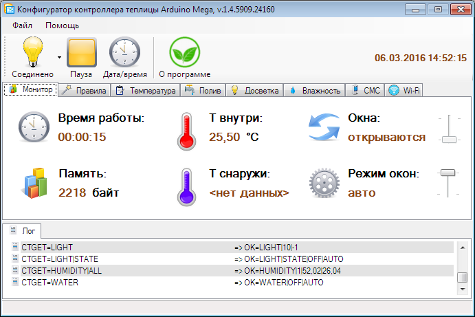
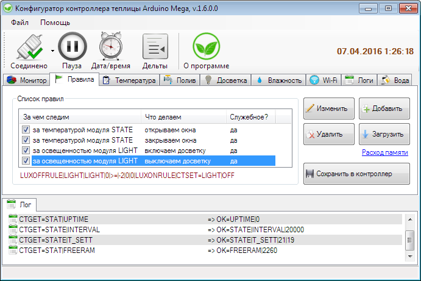
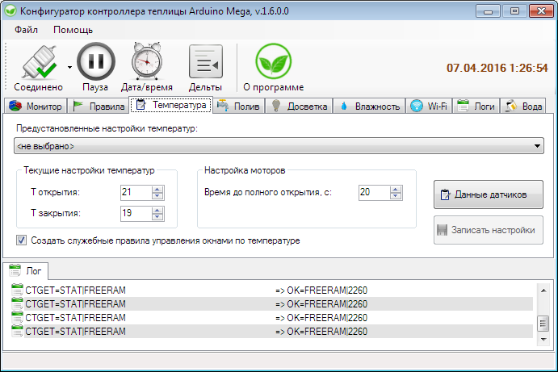
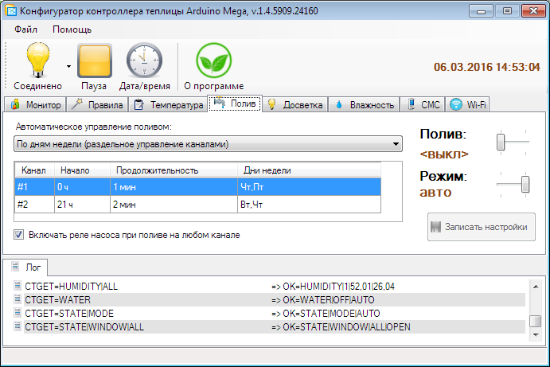
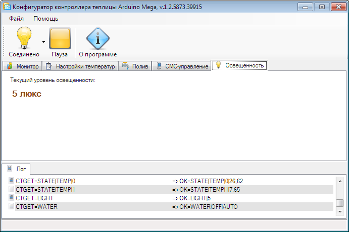
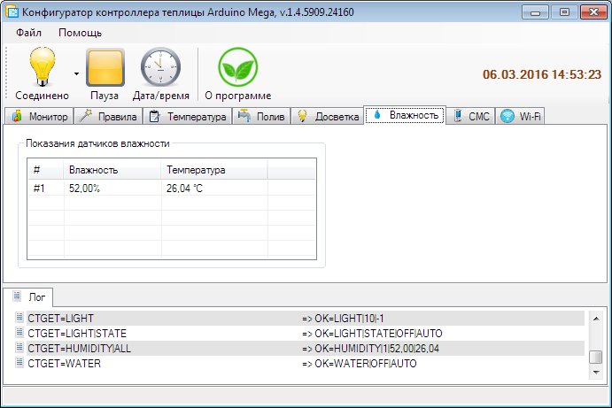
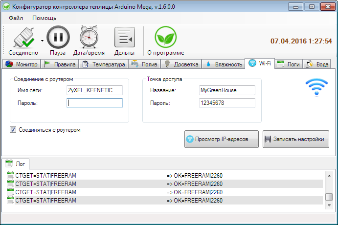
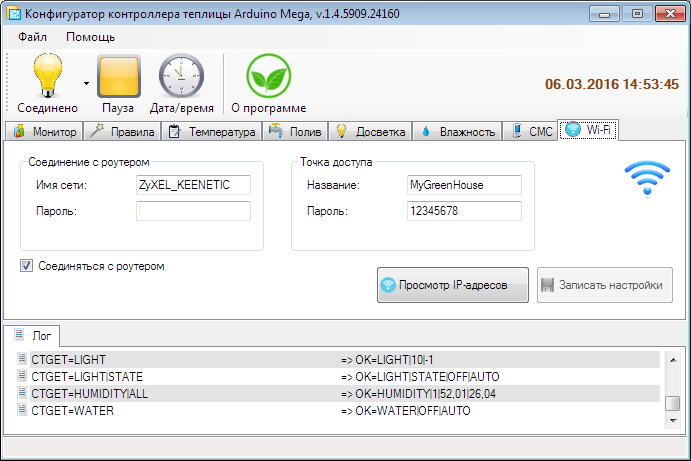
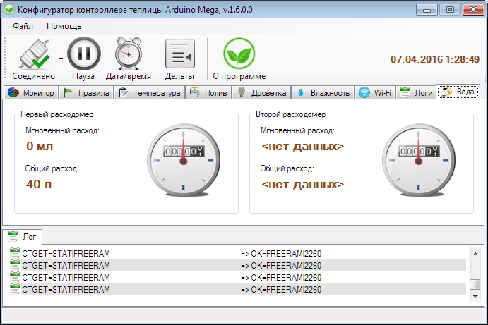
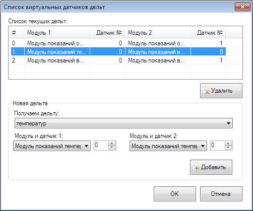
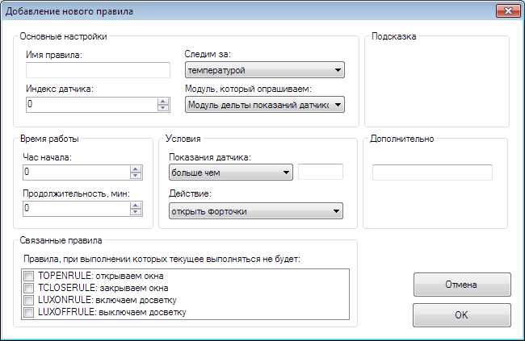

# Как использовать

<b>Установить библиотеку OneWire (в папке Libraries архива) в среду Arduino IDE!</b>

<b>Все настройки прошивки перед компиляцией - в файле Globals.h!</b>

Распаковать архив в папку на диске, установить библиотеки из папки <b>Libraries</b> архива в среду Arduino IDE. Затем открыть в Arduino IDE файл <b>Main.ino</b>, настроить директивы условной компиляции (файл <b>Globals.h</b>), скомпилировать его и закачать в Мегу. Подсоединить зелёный светодиод к пину 6, красный - к пину 7, ещё один - к пину 8, четвёртый - к пину 9. При необходимости - подсоединить модули часов реального времени, GSM и другие - в зависимости от настроек условной компиляции. <b>Если используется модуль Wi-Fi или модуль логгирования информации - подключить модуль SD-карты и закачать файлы из папки SD в корень SD-карточки!</b>

Открыть конфигуратор и подключиться к COM-порту, на котором висит Мега, и начать общение с контроллером. Принципиальная схема подключения некоторого железного добра указана ниже: 

<h2>Модуль LCD 128x64 на базе контроллера ST7920</h2>

В текущей версии используется LCD-экран 128х64 на базе контроллера ST7920, подключенный в режиме последовательного соединения. Подробности подключения - в файле Globals.h. 
Если вам не нужно использование этого модуля - закомментируйте USE_LCD_MODULE в файле Globals.h.

<b>Внимание!</b> Для того, чтобы использовать указанный экран - необходимо установить библиотеку U8GLib (есть в архиве проекта) в среду Arduino IDE!

 Экран работает совместно с энкодером и тактовой кнопкой (подробности подключения - в Globals.h). Энкодером перелистываются закладки, затем кнопкой - производится переход внутрь выбранной закладки и пролистывание вариантов настроек. На экране ожидания нажатия кнопки пролистывают показания с датчиков, не дожидаясь времени их программного пролистывания. На экране ожидания можно вывести информацию со сколь угодно большого количества датчиков (настраивается в Globals.h).

<h2>Модуль поддержки дисплеев Nextion</h2>

В текущей версии используется модуль поддержки дисплеев Nextion (320x240). Если вам не нужно использование этого модуля - закомментируйте USE_NEXTION_MODULE в файле Globals.h. Прошивка для дисплея и её исходники - лежат в папке Nextion. Подробности по закачиванию прошивки в дисплей - в файле Nextion\320x240\Readme.txt.

<h2>Модуль датчиков расхода воды</h2>

В текущей версии используется модуль датчиков расхода воды на эффекте Холла (трёхпроводные с Али, искать по словам "water flow meter", они обычно около 300 рублей стоимостью). Если вам не нужно использование этого модуля - закомментируйте USE_WATERFLOW_MODULE в файле Globals.h. Датчиков может быть до двух, сидят они на пинах 2 и 3. Подробные настройки - в Globals.h.

<h2>Модуль часов реального времени DS3231</h2>

В текущей версии используется модуль часов реального времени на микросхеме DS3231 (пин 20 - SDA, пин 21 - SCL). Если вам не нужно использование этого модуля - закомментируйте USE_DS3231_REALTIME_CLOCK в файле Globals.h.

<h2>GSM-модуль Neoway M590</h2>

В текущей версии используется GSM-модуль на базе чипа NEOWAY M590. Если вы не хотите использовать управление по SMS - закомментируйте USE_SMS_MODULE в файле Globals.h. 
Если у вас возникли проблемы с работой SMS-модуля - можно включить отладочный режим (<b>не работает совместно с конфигуратором!</b>), раскомментировав NEOWAY_DEBUG_MODE в файле Globals.h. <b>Внимание!</b> Для контроля доступности GSM-модуля используется его выход VCCIO (ножка номер 6 по даташиту). Если у вас эта ножка не выведена на плате - надо подпаяться к чипу. Как подключать (смотри принципиальную схему выше): от ноги VCCIO чипа NEOWAY M590 идёт контакт на пин 10 Меги, этот пин подтянут к земле резистором номиналом 100К.

Список команд для управления по SMS - смотрите в конфигураторе. Если вы посылаете команду на открытие или закрытие окон - контроллер автоматически переходит в ручной режим работы!

<h2>Модуль Wi-Fi ESP8266</h2>

В текущей версии используется WI-FI-модуль на основе чипа ESP8266. Если вы не хотите использовать WI-FI в проекте - закомментируйте USE_WIFI_MODULE в файле Globals.h.
Если у вас возникли проблемы с работой WI-FI-модуля - можно включить отладочный режим (<b>не работает совместно с конфигуратором!</b>), раскомментировав WIFI_DEBUG в файле Globals.h. Модуль ESP8266 соединён с Serial2 Меги (пины 16 и 17, см. схему выше).

В текущей редакции реализован мост UART-TCP/IP: соединившись с IP, которое выдал роутер модулю ESP - можно посылать команды контроллеру так же, как если бы это было посредством соединения через UART, т.е.: любая команда начинается с CTGET= или CTSET=, и заканчивается переводом строки \r\n.

<b>Работа с ESP протестирована на версии AT-прошивки 0.40, работоспособность на других прошивках не гарантируется!</b>

<h2>Модуль управления поливом</h2>

<b>ВНИМАНИЕ!</b> Реле, используемые в текущей версии прошивки, включаются по низкому уровню. Если у вас наоборот - смотрите настройки <b>RELAY_ON</b> и <b>RELAY_OFF</b> в файле <b>Globals. h</b>.

Для индикации ручного режима управления поливом на пин 8 выведен светодиод (см. схему), который будет мигать при переключении в ручной режим работы. Для управления каналами реле задействованы пины 22, 23, 24, с которых идёт управление тремя каналами реле. Можно рулить каким угодно количеством реле, вплоть до 8. Для изменения кол-ва реле в файле Globals.h установите WATER_RELAYS_COUNT в нужное число - от 1 до 8. Пины прописываются в WATER_RELAYS_PINS, каждый пин указывается через запятую, их общее количество должно быть равным количеству, указанному в настройке WATER_RELAYS_COUNT!

При подаче любой команды модулю управления поливом (начать/закончить полив, а также когда настройка "Автоматическое управление поливом" в положении "выключено") - контроллер переходит в ручной режим управления поливом, при этом мигает светодиод на пине 8. Номер пина для диода можно изменить с помощью настройки DIODE_WATERING_MANUAL_MODE_PIN в файле Globals.h.

<h2>Модуль освещенности BH1750</h2>

В текущей версии используется модуль освещенности на базе чипа BH1750. Если вам не нужно использование этого модуля - закомментируйте USE_LUMINOSITY_MODULE в файле Globals.h. Схема подключения модуля освещенности приведена выше.

<h2>Модуль влажности</h2>

В текущей версии используется модуль опроса датчиков влажности на базе различных чипов. Поддерживаются следующие типа: DHT - DHT11 и старше, Si7021. Для добавления датчиков смотрите примеры ADD_HUMIDITY_SENSOR в файле Globals.h. Если вам не нужно использование этого модуля - закомментируйте  USE_HUMIDITY_MODULE в файле Globals.h.

# Конфигуратор

Конфигуратор автоматически подцепляет прошитые в контроллер модули, и показывает вкладки управления этими модулями, после соединения с контроллером. Если вы не видите вкладку управления поливом (например) - смотрите директивы условной компиляции на предмет того, выключен ли модуль из компиляции или нет. При перезагрузке контроллера он переходит в автоматический режим работы, даже если при последнем обращении к нему был выставлен ручной режим.

# Ограничения, фичи и ошибки текущей редакции

При работе с Wi-Fi не гарантирована стабильность, т.к. из-за особенностей обвязки, которую предлагает Arduino IDE - могут пропадать данные, посланные модулем ESP8266, и принятые через Serial2. Это связано с тем, что Arduino IDE не предоставляет инструментов для своевременного реагирования по приходу данных, и выход тут только один - отказываться от всех HardwareSerial, и переводить работу с UART на прерывания. Или - модифицировать HardwareSerial, идущий в поставке Arduino IDE, дописав там вызов пользовательской функции по приходу символа в приёмный буфер UART. В общем, пока всё оставлено как есть, и будет дорабатываться позднее.
